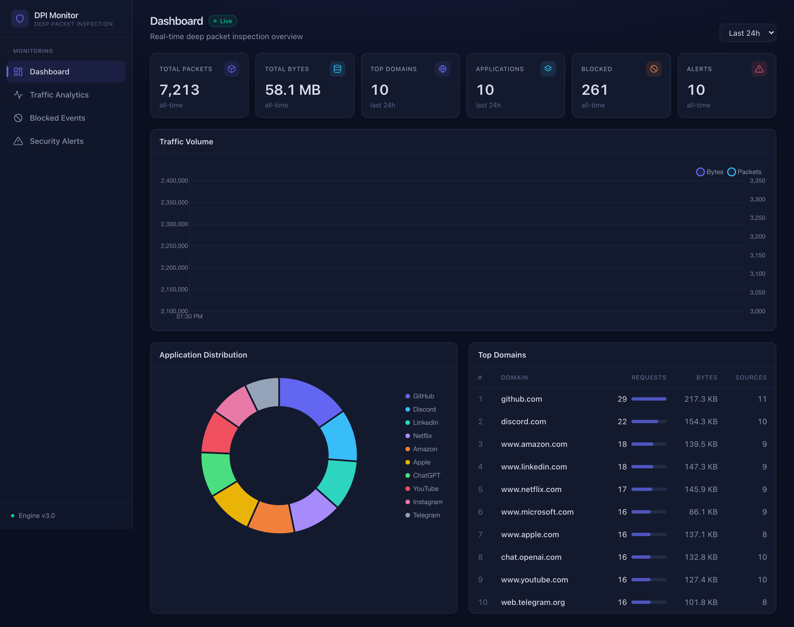
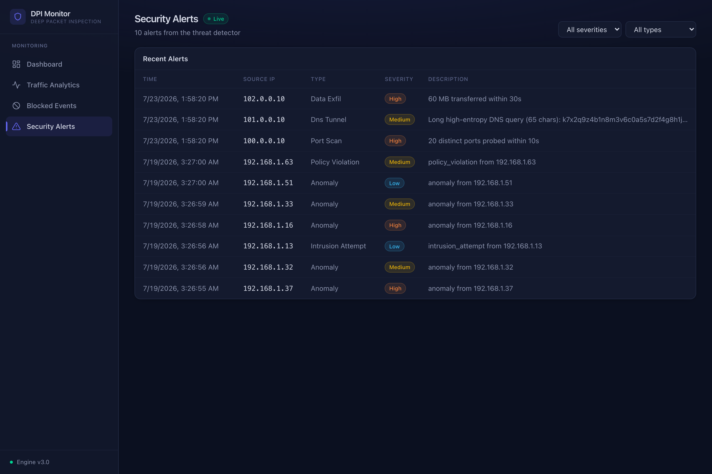
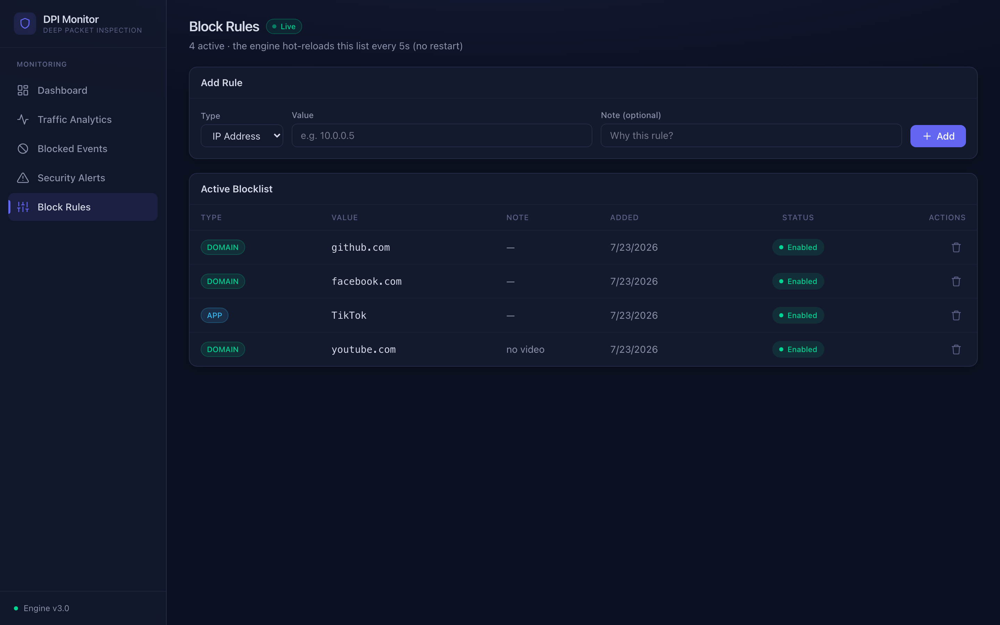
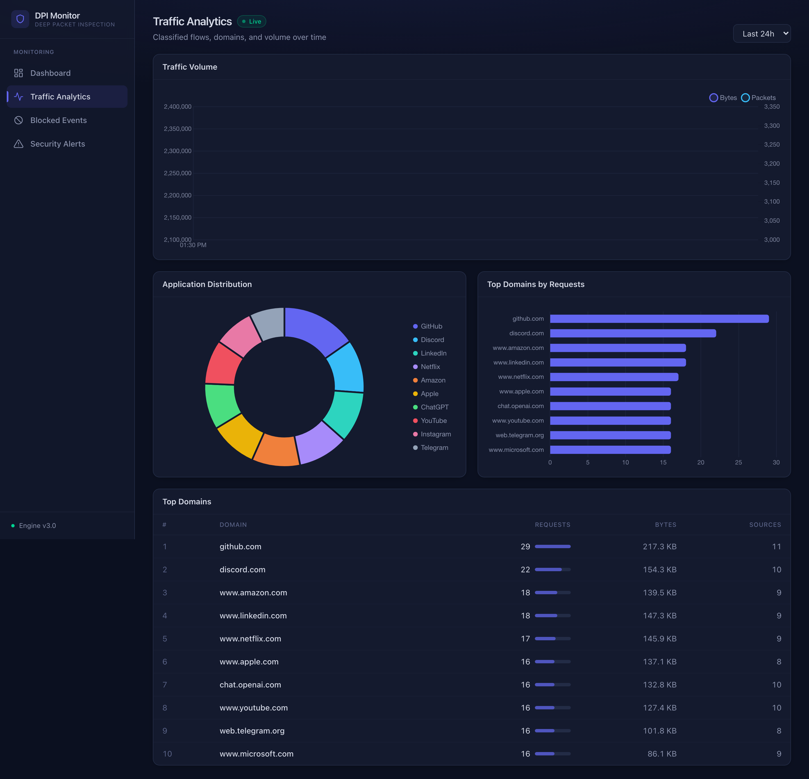
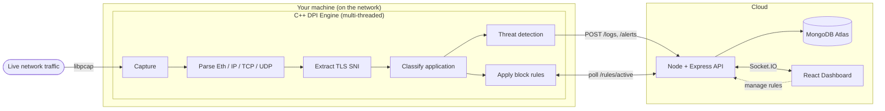

<div align="center">

# 🛡️ DPI Monitor — Deep Packet Inspection Platform

**A real-time network monitoring system that sees which apps and websites your traffic is going to, flags suspicious activity, and blocks what you tell it to — all from a live dashboard.**

[](#-tech-stack)
[](#-tech-stack)
[](#-tech-stack)
[](#-tech-stack)
[](#-tech-stack)

### 🔗 [**Live Dashboard → deep-packet-inspection-iota.vercel.app**](https://deep-packet-inspection-iota.vercel.app)

<sub>The dashboard is deployed; the packet-capture engine runs locally (real DPI must — see [Why it runs locally](#-why-the-engine-runs-locally)).</sub>



</div>

---

## 📖 What is this? (in plain English)

Every time you open a website or app, your device sends **packets** across the network. Normally you can't tell *what* those packets are for — especially with HTTPS, where everything looks encrypted.

**Deep Packet Inspection (DPI)** is the technique network operators (ISPs, companies, firewalls) use to look *inside* traffic and figure out what's going on. This project is a working DPI platform that:

1. **Captures** live network traffic from your machine.
2. **Identifies** which app or website each connection is for — e.g. *YouTube*, *GitHub*, *Zoom* — even over HTTPS, by reading the domain name from the TLS handshake (the one part that isn't encrypted).
3. **Detects threats** with real heuristics — port scans, DNS tunneling, and data exfiltration.
4. **Blocks** traffic you don't want (by app, domain, or IP), managed live from the dashboard.
5. **Visualizes** everything in real time on a web dashboard — traffic volume, top domains, alerts, and blocked events.

> 💡 **The clever bit:** HTTPS is encrypted, but the destination domain is sent in *plaintext* in the very first packet (the TLS "Client Hello" → the **SNI** field). That's how the engine knows you're visiting `youtube.com` without decrypting anything.

---

## 🖥️ Screenshots

| Security Alerts (real detection) | Block Rules (live control) |
|:--:|:--:|
|  |  |
| Port-scan, DNS-tunnel & data-exfil alerts raised by the engine, filterable by severity & type. | Add/toggle/delete block rules — the engine hot-reloads them within 5s, no restart. |



---

## 🏗️ Architecture

The system has three tiers: a **local C++ engine** that captures and inspects packets, a **cloud backend** that stores and serves the data, and a **web dashboard** that visualizes it live.



**How data flows:**
- The **engine** captures packets, classifies them, runs threat heuristics, and ships JSON logs/alerts to the backend over HTTP (batched, async).
- The **backend** stores everything in MongoDB and pushes live updates to the dashboard over WebSocket (Socket.IO).
- **Block rules** flow the other way: you manage them on the dashboard → backend → the engine polls them and hot-reloads its blocklist.

---

## ✨ Features

- **🔍 Live packet capture** via libpcap (plus an offline PCAP-file mode for testing).
- **🌐 Application classification** from TLS SNI / HTTP Host — identifies 20+ apps without decryption.
- **🚨 Real threat detection** (not simulated):
  - **Port scan** — one source hitting many distinct ports in a short window.
  - **DNS tunneling** — abnormally long, high-entropy DNS query names (Shannon entropy).
  - **Data exfiltration** — a source pushing an unusually large byte volume.
- **⛔ Live block rules** — block by IP, application, or domain; the engine hot-reloads without restarting.
- **📊 Real-time dashboard** — traffic volume, top domains/apps, blocked events, and security alerts, all updating live over WebSocket.
- **⚡ Multi-threaded engine** — a load-balancer → fast-path thread pool with consistent 5-tuple hashing, so each connection is handled by one thread.
- **🗄️ Time-series storage** — MongoDB with TTL retention and aggregation pipelines powering the analytics.

---

## 🧰 Tech stack

| Layer | Technologies |
|---|---|
| **DPI Engine** | C++17 · [libpcap](https://www.tcpdump.org/) (capture) · [libcurl](https://curl.se/libcurl/) (HTTP) · POSIX threads · CMake |
| **Backend** | Node.js · Express · MongoDB (Atlas) · Socket.IO · Winston (logging) · Helmet (security headers) |
| **Frontend** | React 19 · Vite · Tailwind CSS v4 · Chart.js · React Router · Socket.IO client |
| **Deployment** | Render (backend) · Vercel (frontend) · MongoDB Atlas (database) |
| **Testing** | Custom C++ unit/integration tests + a bash self-test suite |

---

## ⚡ Performance

The engine has a built-in benchmark mode that replays a capture through the **full pipeline** (parse → SNI classify → rule match) and reports throughput:

```bash
./build/dpi_engine test_dpi.pcap --bench 100000
```

Measured on an **Apple M1** with small 74-byte-average packets (the worst case for per-packet rate):

| Metric | Value |
|---|---|
| **Throughput** | **~435,000 packets/sec** |
| Data rate | ~0.26 Gbit/s at 74 B · **~5 Gbit/s** at a typical 1500 B MTU |

The benchmark also surfaced a nice profiling insight: throughput is bounded by the **single capture/dispatch thread** (per-packet buffer copy + protocol parsing), not the fast-path pool. Per-packet shared-state contention was removed along the way (per-thread stat counters + a `shared_mutex` for concurrent rule lookups); the next scaling step is parallelizing capture/parse or a zero-copy packet pool.

---

## 🚀 Getting started

### Prerequisites
- **C++17 toolchain** + **CMake** (`libpcap` & `libcurl` ship with macOS / Xcode CLT; on Debian/Ubuntu: `sudo apt install libpcap-dev libcurl4-openssl-dev cmake g++`)
- **Node.js 18+**
- A **MongoDB** connection string (free [MongoDB Atlas](https://www.mongodb.com/atlas) cluster works)

### 1. Backend (API + WebSocket)
```bash
cd backend
cp .env.example .env          # then fill in MONGODB_URI
npm install
npm start                     # → http://localhost:8000
```

### 2. Frontend (dashboard)
```bash
cd frontend
npm install
npm run dev                   # → http://localhost:3000
```

### 3. C++ engine
```bash
cmake -B build && cmake --build build
./build/dpi_engine --help
```

---

## 📡 Live capture demo

Point the engine at your backend and watch the dashboard come alive:

```bash
# See available interfaces (en0 is usually Wi-Fi on macOS)
./build/dpi_engine --list-interfaces

# Capture live traffic (raw sockets need sudo) and ship to the backend
sudo ./build/dpi_engine --interface en0 --backend-url http://localhost:8000
```

Now browse the web and open the dashboard — **Total Packets/Bytes** climb, **Top Domains/Apps** populate, and everything updates live.

**Try the features:**
```bash
# 1. Blocking: on the dashboard's Block Rules page, add domain "youtube.com".
#    Within 5s the engine hot-reloads it → YouTube is dropped and appears in Blocked Events.

# 2. Threat detection: trigger a port-scan alert
nmap -p 1-1000 scanme.nmap.org
```

> **Offline mode** (no capture, no sudo) — run the engine on a saved capture:
> ```bash
> ./build/dpi_engine test_dpi.pcap output.pcap --block-app YouTube --block-domain facebook.com
> ```

### 🌍 Why the engine runs locally

Packet capture needs raw access to a real network interface — something cloud platforms (Render/Vercel) don't provide. This isn't a limitation of the project; it's how **all** real DPI tools work (Zeek, Suricata, ntopng, enterprise firewalls all run *on* the network). The deployable part — the analytics API and dashboard — **is** deployed. For a live demo, run the engine locally with `--backend-url` pointed at the deployed backend, and the deployed dashboard shows your real traffic in real time.

---

## 🧪 Testing

A one-command self-test covers everything that doesn't need root:

```bash
./scripts/test_local.sh
```

It checks the C++ engine (file-mode blocking), the threat-detection heuristics, the full backend API, and the block-rule control plane (including the real `RuleSync` hot-reload). It auto-builds the engine if needed and cleans up after itself.

---

## 📁 Project structure

```
DPI/
├── include/ · src/          # C++ DPI engine
│   ├── live_capture.*       #   libpcap live capture
│   ├── packet_parser.*      #   Ethernet / IP / TCP / UDP parsing
│   ├── sni_extractor.*      #   TLS SNI + HTTP Host extraction
│   ├── threat_detector.*    #   port-scan / DNS-tunnel / exfil heuristics
│   ├── rule_sync.*          #   polls the backend, hot-reloads block rules
│   ├── log_shipper.*        #   async HTTP delivery of logs & alerts
│   └── dpi_mt.cpp           #   multi-threaded engine (main)
│
├── backend/                 # Node + Express + MongoDB + Socket.IO
│   └── src/
│       ├── routes/          #   /logs /alerts /traffic /stats /analytics /rules
│       ├── services/        #   logger, socket manager
│       └── models/schema.js #   collections, indexes, TTL
│
├── frontend/                # React + Vite + Tailwind dashboard
│   └── src/
│       ├── pages/           #   Dashboard, Traffic, Blocked, Alerts, Rules
│       ├── components/      #   charts, tables, layout
│       └── services/        #   REST + Socket.IO clients
│
├── scripts/test_local.sh    # self-test suite
├── tests/                   # C++ unit / integration tests
└── test_dpi.pcap            # sample capture for offline mode
```

---

## 🗺️ Roadmap

- [x] Live packet capture + application classification
- [x] Real threat detection (port scan, DNS tunnel, data exfil)
- [x] UI-managed block rules with live engine hot-reload
- [x] Real-time dashboard + deployed backend/frontend
- [x] Throughput benchmark (packets/sec) + fast-path lock removal
- [ ] Authentication + API keys (lock down the control plane)
- [ ] GeoIP enrichment + a live world map of destinations

---

## 📝 License

Released under the MIT License — free to use, learn from, and build on.

<div align="center"><sub>Built with C++, Node.js, and React · <a href="https://deep-packet-inspection-iota.vercel.app">Live demo</a></sub></div>
